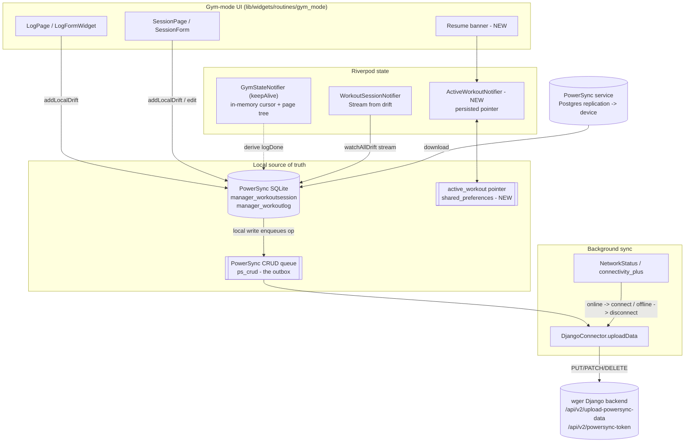
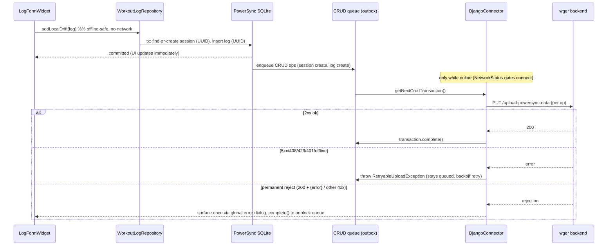
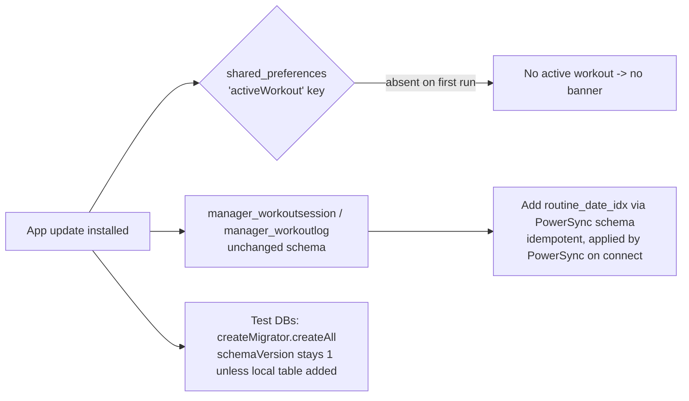

# Design: Offline-First Workout Logging & Active-Workout Persistence (wger Flutter)

| | |
|---|---|
| **Title** | Offline-first workout logging with background sync, and active-workout state persistence |
| **Author** | _<placeholder — assign on submission>_ |
| **Date** | 2026-06-20 |
| **Status** | Draft |
| **Repo** | `wger-project/flutter` (working copy: `/home/magma/Projects/wger-flutter`) |
| **Scope** | `lib/providers/gym_*`, `lib/widgets/routines/gym_mode/*`, `lib/providers/workout_*`, `lib/powersync/*`, `lib/database/powersync/*` |

---

## 1. Overview

This document covers two deeply related improvements to the wger Flutter gym-mode experience:

1. **Offline-first workout logging with background sync** — workout sessions and set-logs should be written to local storage first (the source of truth while training) and synced to the wger backend in the background with retry/backoff, connectivity-awareness, and idempotency.
2. **Bug: in-progress workout state is lost on exit** — after a user "starts" a gym-mode workout, leaving the screen (or killing the app) loses the visible progress (current position, which sets/exercises are complete), and there is no way to resume.

**The single most important finding of this investigation** — which materially changes the shape of the design versus the original problem framing — is that **the wger Flutter app already runs against a real PowerSync sync service, and workout sessions/logs are already local-first.** They are PowerSync-managed [drift](https://drift.simonbinder.eu/) tables with client-generated UUID primary keys, written locally first and uploaded in the background by an existing, tested connector. See [`lib/powersync/connector.dart`](lib/powersync/connector.dart), [`lib/database/powersync/tables/routines.dart`](lib/database/powersync/tables/routines.dart), and [`lib/providers/workout_logs_repository.dart`](lib/providers/workout_logs_repository.dart).

Consequently this design is **mostly an integration, hardening, and UX design, not a green-field sync engine**. The central recommendation is to **reuse the existing PowerSync write path** for offline logging (Problem 1) and to **add a small persisted "active workout" pointer** that makes the gym-mode UI read its completion state from the already-persisted logs (Problem 2). Both rest on the same principle: **the local database is the source of truth.**

---

## 2. Background & Motivation

### 2.1 What actually exists today (verified against the code)

**PowerSync is a real backend service, not just a local drift DB.** The wger Django backend exposes two PowerSync-specific endpoints, consumed by [`lib/powersync/api_client.dart`](lib/powersync/api_client.dart):

- `GET /api/v2/powersync-token` → short-lived PowerSync JWT + endpoint URL (`ApiClient.getPowersyncToken`, lines 47–57).
- `PUT|PATCH|DELETE /api/v2/upload-powersync-data` → generic write-back endpoint (`ApiClient.upsert/update/delete`, lines 64–74).

The download path (Postgres → device) is handled by the PowerSync service; the upload path is handled by [`DjangoConnector`](lib/powersync/connector.dart) which drains PowerSync's local CRUD queue (`database.getNextCrudTransaction()`, line 173) and POSTs each op to the generic endpoint.

**Workout sessions and logs are already PowerSync-managed, local-first drift tables.** In [`lib/database/powersync/tables/routines.dart`](lib/database/powersync/tables/routines.dart):

- `manager_workoutlog` (`WorkoutLogTable`, lines 61–113) — primary key `id` is `text().clientDefault(() => ps.uuid.v7())` (line 66). It references its parent session via `sessionId` (`session_id` **text**, line 69), i.e. **the parent's client UUID**, not a server-assigned integer.
- `manager_workoutsession` (`WorkoutSessionTable`, lines 115–146) — primary key `id` is likewise a client UUID v7 (line 120). It carries `routine_id`, `day_id`, `date`, `notes`, `impression`, `time_start`, `time_end`.

Both tables are registered with PowerSync in [`lib/powersync/schema.dart`](lib/powersync/schema.dart) (`PowersyncWorkoutLogTable`, `PowersyncWorkoutSessionTable`, lines 68–69) and with drift in [`lib/database/powersync/database.dart`](lib/database/powersync/database.dart) (lines 100–101).

**The write path is already local-first.** [`WorkoutLogRepository.addLocalDrift`](lib/providers/workout_logs_repository.dart) (lines 64–97) writes to the local drift DB inside a transaction; if the log has no `sessionId`, it finds-or-creates a session for the day and points the log at that session's **local UUID**. No network call is involved in the write — connectivity is irrelevant to persistence. The UI path confirms this: in [`lib/widgets/routines/gym_mode/log_page.dart`](lib/widgets/routines/gym_mode/log_page.dart) the "save log" button (lines 342–388) calls `logProvider.addEntry(log)` → `WorkoutLogMutations.addEntry` → `addLocalDrift`.

**Background upload already exists with retry/backoff, connectivity-awareness, and idempotency.** [`DjangoConnector.processTransaction`](lib/powersync/connector.dart) (lines 189–247) classifies each response (`_classifyResponse`, lines 250–269): 2xx → complete; `{error}` body → permanent reject (surfaced once via the global error dialog, `_reportRejection`); 5xx/408/429/401 or unreachable → throw `RetryableUploadException` so PowerSync re-queues and retries on its own backoff schedule. The connector documents the idempotency contract explicitly (lines 186–188): *"A retry re-sends the whole transaction (at-least-once), so backend handlers must be idempotent."* Idempotency is achieved by **client-generated UUID PKs** + idempotent server upsert. Connectivity gating happens in [`lib/powersync/powersync.dart`](lib/database/powersync/powersync.dart) `syncConnection` (lines 69–81): the DB connects only while `networkStatusProvider` reports online and disconnects otherwise.

### 2.2 What this means for the two problems

- **Problem 1 (offline logging + background sync): the core machinery already exists and should be reused.** The "create the session server-side first, then patch its id onto pending logs" dependency-ordering problem described in the original framing **does not exist here**, because logs reference the session by its **client UUID**, generated locally before any sync. The session and its logs upload as independent ops in the same CRUD queue; the server resolves the FK by UUID. What remains is hardening (duplicate-session guard, edit/delete semantics, per-entry sync visibility) and confirming the offline gym-mode entry path.

- **Problem 2 (lost active-workout state): this is the genuinely missing piece, and it is small** *(but see §4.5 / PR1 for the honest sizing — it is small in concept but touches the gym-mode entry flow).* [`GymStateNotifier`](lib/providers/gym_state_notifier.dart) is `@Riverpod(keepAlive: true)` (line 33), so its `GymModeState` is **purely in-memory**. The **cursor** (`currentPage`) survives in-app navigation (the keepAlive notifier + `initData`'s conditional preservation, §4.2.1) but the **per-slot `logDone` flags do not** — they are lost on *both* app kill/restart *and* in-app re-entry, because `_loadGymState` ([`gym_mode.dart:69-107`](lib/widgets/routines/gym_mode/gym_mode.dart)) runs from `initState` on every (re)creation of the `GymMode` widget and calls `calculatePages()` **unconditionally** at line 104, rebuilding the page tree with `logDone = false`. There is also no surfaced "resume" affordance, and the state is wiped by `clear()` when the last page is reached ([`gym_mode.dart`](lib/widgets/routines/gym_mode/gym_mode.dart) lines 182–183). Crucially, the *logged sets themselves are already persisted* in `manager_workoutlog`; only the **gym-mode progress overlay** (cursor + per-slot `logDone` flags) is volatile.

### 2.3 Why couple them

Both problems are solved by the same principle and the same data: **the local DB is the source of truth, and the gym-mode UI should read its completion state from persisted logs rather than from volatile in-memory flags.** Fixing Problem 2 the right way (derive completion from the already-synced logs + persist a tiny pointer) makes the UI offline-correct by construction, and it is the foundation on which the offline-logging story is closed out. The bug fix is deliverable first and independently (it requires no backend change).

---

## 3. Goals & Non-Goals

### Goals
- **G1.** Logging a session/set never depends on live connectivity; writes are committed locally and visible immediately, online or offline. *(Largely satisfied today; we verify, test, and harden it.)*
- **G2.** Pending writes sync to the backend in the background when connectivity returns, with retry/backoff and **no duplicate sessions/logs across retries or app-kill**.
- **G3.** In-progress gym-mode state (cursor position + per-set completion) survives navigation **and app restart**.
- **G4.** On app open, an unfinished workout is detected and the user is offered a **Resume** experience.
- **G5.** Per-workout sync visibility (pending/synced/failed) and a clearly defined edit/delete story for unsynced vs synced entries.
- **G6.** Test coverage for outbox/idempotency, offline→online transitions, and resume-after-exit.

### Non-Goals
- **NG1.** Building a *new* outbox queue or sync engine. We reuse PowerSync's CRUD queue. (See Alternatives §9.)
- **NG2.** True OS-level background execution while the app is killed (no `workmanager`). We scope to foreground + connectivity-driven sync. (Rationale in §6.4.)
- **NG3.** Field-level conflict merging / CRDTs. Conflicts resolve last-write-wins via PowerSync.
- **NG4.** At-rest encryption (SQLCipher) of the PowerSync DB — flagged as an open question (§13), not implemented here.
- **NG5.** Changes to the exercise/routine catalogue sync.

---

## 4. Proposed Design

### 4.1 High-level architecture



**Key:** Everything left of `BE`/`PS` works fully offline. The only NEW persistent artifacts are the `active_workout` pointer (a few fields in `shared_preferences`) and a NEW `ActiveWorkoutNotifier`. The outbox is PowerSync's existing CRUD queue.

### 4.2 Problem 2 — active-workout persistence & resume

#### 4.2.1 Root cause (precise)

`GymModeState` ([`lib/providers/gym_state.dart`](lib/providers/gym_state.dart)) holds:
- `pages` / `currentPage` — the navigation tree and cursor.
- per-slot `SlotPageEntry.logDone` (lines 115–116) — whether a given log page was marked done.
- `dayId`, `iteration`, `routine`, `startTime`, `validUntil`.

It is produced by `GymStateNotifier.build()` ([`gym_state_notifier.dart`](lib/providers/gym_state_notifier.dart) line 38) returning a fresh `GymModeState()`. Because the notifier is `keepAlive: true`, the state object is **not** disposed on screen exit. The failure modes are:

- **`logDone` is lost on in-app re-entry, not only on app kill.** `_loadGymState` ([`gym_mode.dart:69-107`](lib/widgets/routines/gym_mode/gym_mode.dart)) runs from `initState` every time the `GymMode` widget is rebuilt and calls `calculatePages()` **unconditionally** at line 104, which regenerates the page tree with `logDone = false`. The cursor survives (keepAlive notifier + `initData`, below) but the completion ticks do not. App kill/restart additionally drops the cursor, since `build()` returns a fresh state.
- **No resume entry point.** The only navigation into gym mode is `Navigator.pushNamed(GymModeScreen.routeName, arguments: GymModeArguments(...))` from [`widgets/routines/day.dart:164`](lib/widgets/routines/day.dart) and [`widgets/dashboard/widgets/routines.dart:253`](lib/widgets/dashboard/widgets/routines.dart). After leaving, nothing surfaces the in-progress workout.
- **`initData` is *not* an unconditional reset.** It computes `shouldReset = (!isInitialized || dayId != state.dayId) || validUntil.isBefore(now)` ([`gym_state_notifier.dart:245-247`](lib/providers/gym_state_notifier.dart)) and preserves `state.currentPage` (skipping `calculatePages`) when `!shouldReset`. So in-process cursor resume already partially works; our fix *augments* this branch rather than replacing it (§4.2.4, §8).
- **`clear()`** wipes `isInitialized`, `pages`, `currentPage`, `validUntil`, `startTime` on reaching the last page ([`gym_mode.dart:182-183`](lib/widgets/routines/gym_mode/gym_mode.dart)) (also invoked from `onPageChanged`). Note it is a **partial** clear: `dayId`, `iteration`, `routine` are `late final` on `GymModeState` and are left set (re-applied via `copyWith`). This is benign today, but the resume `shouldReset` logic must be reasoned about against this partial-clear behavior (it relies on `isInitialized`/`dayId`, both handled correctly: `isInitialized` is reset, so a post-`clear` re-entry rebuilds pages).

Note the redundancy: `logDone` is a **second copy** of information already implied by persisted logs. Every successful save writes a `manager_workoutlog` row (verified in `LogFormWidget`, [`log_page.dart:367,372`](lib/widgets/routines/gym_mode/log_page.dart)) *and* flips `logDone`. The flag is what is lost; the log is not. Deriving completion from the logs therefore fixes **both** the in-app-re-entry loss and the app-kill loss with one mechanism.

#### 4.2.2 Approach: persist a pointer, derive completion from logs

Rather than serialize the whole `GymModeState` (a large object graph including `Routine`), we persist a **small pointer** and **reconstruct completion from the logs that are already in the DB**. This keeps a single source of truth and guarantees the resumed view matches what actually synced.

**New persisted record — `ActiveWorkout`** (stored as one JSON blob in `shared_preferences`; see §5.3 for the drift-table alternative):

```dart
class ActiveWorkout {
  final int routineId;
  final int dayId;
  final int iteration;
  final DateTime startedAt;     // = clock.now() at workout start (calendar anchor for "today's session")
  final TimeOfDay? startTime;   // optional wall-clock start for display (mirrors GymModeState.startTime)
  final int currentPage;        // cursor to restore
  final DateTime validUntil;    // existing GymModeState.validUntil semantics (DEFAULT_DURATION = 5h)

  // Serialized to a single shared_preferences string key 'activeWorkout'.
}
```

> **`startedAt` is a `DateTime`, sourced from `clock.now()` at workout start** — *not* from `GymModeState.startTime`, which is a `TimeOfDay` ([`gym_state.dart:171,204`](lib/providers/gym_state.dart)) carrying only hour/minute and therefore unable to anchor a calendar day. `startedAt` uses the same basis as the session's `date` (`clock.now()` → midnight-UTC of that day), so "today's session" matching is reliable. `GymModeState.startTime` (TimeOfDay) is kept as a separate optional field only if a wall-clock start is wanted for display.

**Single active workout (v1 assumption).** The pointer is a **singleton**: v1 supports exactly one in-progress workout at a time. If `ActiveWorkoutNotifier.start()` is called while a *different* pointer already exists (a second routine/day started before finishing the first), the app **prompts the user** ("You have an unfinished workout — discard it and start this one?") rather than silently overwriting. Multi-active workouts are an explicit follow-up (Open Question §13).

**Write points** (cheap, debounced):
- On `initData` (workout start) → `start()` writes the pointer (with the discard-prompt guard above).
- On `GymStateNotifier.setCurrentPage` ([`gym_state_notifier.dart:273`](lib/providers/gym_state_notifier.dart)) → `updateCursor()` updates `currentPage`.
- On explicit **finish** → `finish()` deletes the pointer. "Finish" is defined as **the session being explicitly saved** via `SessionForm.onSaved` on the session page ([`session_page.dart:71-78`](lib/widgets/routines/gym_mode/session_page.dart)), *not* merely reaching the last `PageView` index. This avoids the trap where swiping to the summary page (accidentally or to peek) and backing out would wipe the resume pointer for a workout the user never finished. `clear()` of the in-memory state remains tied to the last page as today, but the **persistent pointer is only deleted on explicit save** (regression-tested, §15).

**Restore points:**
- On app open / dashboard build, `ActiveWorkoutNotifier` loads the pointer. If present and `validUntil` is in the future, an unfinished workout exists.
- On entering gym mode, `GymStateNotifier.initData` feeds `currentPage` from the pointer into the existing `shouldReset` branch (§4.2.4, §8) rather than resetting to 0.
- `logDone` is **derived synchronously** from an in-memory snapshot of the session's logs, loaded once per gym-mode entry. `calculatePages()` stays a synchronous `void`; it applies the cached snapshot. See §4.2.3 for why this avoids a sync→async refactor.

#### 4.2.3 Defining "set / exercise complete" from persisted logs

A *set* corresponds to a log-type `SlotPageEntry` keyed by `setConfigData.slotEntryId` + `exercise.id`. The slot may have N log pages (N working sets). Completion is reconstructed as:

> For each `(slotEntryId, exerciseId)` group, count persisted logs = `k`; mark the **first `k`** log-type `SlotPageEntry`s of that group as `logDone = true`.

**Keep the derivation synchronous via an in-memory snapshot (this is the design decision that keeps PR1 tractable — see Issue 1 below).** The naive approach — `await`ing the DB inside `calculatePages()` — would turn that **synchronous `void`** ([`gym_state_notifier.dart:106-185`](lib/providers/gym_state_notifier.dart)) into a `Future`, rippling into *every* synchronous caller: `setShowExercisePages` (290), `setShowTimerPages` (297), `addExerciseAfterPage`→`recalculateIndices`, and `_loadGymState` (104) — all of which are sync UI setters — and it would couple `GymStateNotifier` to `workoutSessionProvider` and re-hit the DB on every settings toggle. We avoid all of that:

1. `GymStateNotifier` holds a private **in-memory snapshot** field — a per-`(slotEntryId, exerciseId)` count map `Map<(int?, int), int> _logCountsBySlot = {}`.
2. A **new** `Future<void> restoreCompletionFromLogs()` reads the session's logs **once** per gym-mode entry, populates `_logCountsBySlot`, and re-applies derivation. It is the *only* async/DB-touching addition and is **not** called from any settings setter. The map is then kept current by `markSlotPageAsDone` on each save/undo (see the snapshot invariant below).
3. `calculatePages()` **stays synchronous** and, at its end, applies a pure, synchronous `_deriveCompletion()` over `_logCountsBySlot`. Because the snapshot is in memory, the settings setters that call `calculatePages()` (toggling timers/exercises mid-workout) re-derive completion **synchronously and for free** — no extra DB read.

> **Snapshot invariant (Issue 11): `_logCountsBySlot` tracks *all* logs persisted in this session, not just those present at entry.** Seeding it once at entry is not enough: the existing save flow flips completion via `markSlotPageAsDone` ([`gym_state_notifier.dart:315-341`](lib/providers/gym_state_notifier.dart), called from [`log_page.dart:372`](lib/widgets/routines/gym_mode/log_page.dart)) and `calculatePages()` rebuilds every `SlotPageEntry` with `logDone = false`, so a settings toggle after a save can only re-tick a set if the snapshot already counts it. We therefore **keep the snapshot current on every mutation**: `markSlotPageAsDone(uuid, isDone: true)` increments `_logCountsBySlot[(slotEntryId, exerciseId)]` and `isDone: false` (undo) decrements it. With this, the snapshot stays in lock-step with the persisted logs, and the "ticks preserved across toggles, no extra DB read" guarantee holds for sets logged **after** entry, not only those present at entry time.

Sequencing in `_loadGymState` ([`gym_mode.dart:104`](lib/widgets/routines/gym_mode/gym_mode.dart)): `initData(...)` → `loadPrefs()` → `calculatePages()` (already there) → **`await restoreCompletionFromLogs()`** (new, runs after the existing unconditional `calculatePages()`). The snapshot is loaded mirroring the existing session lookup in [`session_page.dart:55-64`](lib/widgets/routines/gym_mode/session_page.dart). Thereafter it is maintained incrementally by `markSlotPageAsDone` (above). An *exercise* is complete when all its log slot pages are done (the existing `PageEntry.allLogsDone` getter, [`gym_state.dart:97-98`](lib/providers/gym_state.dart), works against the restored flags).

> **`dayId` vs `(routine, date)` keying (Issue 6).** `addLocalDrift` finds-or-creates the day's session by `routineId & date` **only** (no `dayId` predicate, [`workout_logs_repository.dart:73-74`](lib/providers/workout_logs_repository.dart)), so two *different* routine days trained on the same calendar date share one session row. This is intentional and matches the backend's `(date, routine, user)` uniqueness (§4.3.1). It does **not** contaminate completion marks, because derivation keys on `(slotEntryId, exerciseId)`, which are **day-specific** (a different day's slots have different `slotEntryId`s), so the snapshot for the *current* `dayId` only ever matches the current day's slot pages. To be defensive against duplicate `slotEntryId`s across days of one routine, `restoreCompletionFromLogs()` may additionally filter the snapshot to the logs whose `slotEntryId` appears in the current page tree. The `ActiveWorkout.dayId` is used to rebuild the correct page tree on resume, not to pick the session row.

> **Edge case (documented):** the count-based reconstruction cannot distinguish *which specific* set rows were logged if the user logged sets out of order; it marks the first `k`. This matches user intent ("k of N sets done") and is acceptable. Out-of-order nuance is an open question (§13) but not a correctness problem.

#### 4.2.4 Resume sequence

```mermaid
sequenceDiagram
    participant U as User
    participant D as Dashboard
    participant AW as ActiveWorkoutNotifier
    participant SP as shared_preferences
    participant GM as GymMode screen
    participant GS as GymStateNotifier
    participant DB as drift (logs)

    U->>D: open app
    D->>AW: read()
    AW->>SP: get 'activeWorkout'
    SP-->>AW: {routineId, dayId, iteration, currentPage, validUntil}
    alt pointer present and not expired
        AW-->>D: ActiveWorkout
        D-->>U: show "Resume workout" banner
        U->>GM: tap Resume (GymModeArguments from pointer)
        GM->>GS: initData(...) augments shouldReset, cursor from pointer
        GS->>GS: calculatePages() (sync; applies empty snapshot)
        GM->>GS: await restoreCompletionFromLogs()
        GS->>DB: query today's session logs (one-shot)
        DB-->>GS: persisted logs
        GS->>GS: seed _logCountsBySlot, re-derive logDone (sync)
        GM-->>U: workout restored at saved cursor with ticks
    else absent or expired
        AW-->>D: null -> no banner
    end
```

### 4.3 Problem 1 — offline logging & background sync (reuse + harden)

The data flow already in place:



**Hardening work for Problem 1:**

1. **Duplicate-session guard (idempotency at the local layer).** `addLocalDrift` does a read-then-insert to find-or-create the day's session, matching by `routineId & date` only ([`workout_logs_repository.dart:67-92`](lib/providers/workout_logs_repository.dart)). Two concurrent saves (or a re-entrant call) whose `await`s interleave can both miss and create two sessions for the same `(routine, calendar-date)`, which the server then rejects on its unique `(date, routine, user)` constraint — and, per the existing test comment ([`workout_logs_repository_test.dart:96-97`](test/routine/workout_logs_repository_test.dart)), a rejected session can take its logs down with it. **Mitigation, and its honest limits:** the authoritative client-side guard is an **in-isolate single-flight** (a per-`(routineId, date)` lock / `Completer` cache that serializes find-or-create so the interleaved-`await` case cannot double-create). The proposed `routine_date_idx` (§5.2) only makes the lookup index-backed; **it does not and cannot enforce uniqueness** (PowerSync JSON-view tables carry no SQL `UNIQUE` constraint — drift defines only `routine_idx`/`day_idx` today, [`routines.dart:142-145`](lib/database/powersync/tables/routines.dart)). So R1's defense is (a) the in-isolate single-flight and (b) the **server-side** unique constraint as the only true cross-process/cross-device backstop. There is **no client-enforceable uniqueness backstop** if that server constraint is ever absent — see §5.2 and Issue 8 (the constraint is assumed, to be confirmed against the Django backend). One session per `(routine, calendar-day)` is intentional (it matches the server constraint and is why two days of one routine on the same date share a row; see the `dayId` note in §4.2.3).

2. **Confirm/repair offline gym-mode entry.** `_loadGymState` ([`gym_mode.dart:69-107`](lib/widgets/routines/gym_mode/gym_mode.dart)) already branches on `networkStatusProvider`: online → `fetchAndSetRoutineFull`; offline → cached hydrated routine, else `StateError`. We keep this but ensure the Resume path always uses the cached routine (no network requirement to resume).

3. **Per-entry sync visibility** (Observability, §11): expose pending-upload state derived from PowerSync's queue + the global `syncStatus` provider ([`powersync.dart:183-186`](lib/database/powersync/powersync.dart)).

4. **Edit/delete semantics** for unsynced vs synced entries (§4.4).

### 4.4 Conflict / edit / delete semantics

| Scenario | Behavior | Notes / action |
|---|---|---|
| Edit a **pending** (not-yet-uploaded) log/session | `updateLocalDrift`/`editLocalDrift` updates the drift row; PowerSync coalesces with the queued create so the eventual upload carries the latest values | Already implemented; covered by tests. |
| Edit a **synced** log/session | drift update → PowerSync enqueues a PATCH (`UpdateType.patch` → `ApiClient.update`) | Existing connector path. |
| Delete a **pending-create** row | `deleteLocalDrift` removes the row; PowerSync enqueues a DELETE for an id the server has never seen | **Backend must treat DELETE of an unknown id as a no-op success** (else permanent-reject dialog noise). Coordinate with backend `upload-powersync-data` handler. Risk R3. |
| Delete a **synced** row | DELETE (`UpdateType.delete` → `ApiClient.delete`) | Existing path. |
| Same session edited on two devices | Last-write-wins on download from PowerSync; no field merge | Documented limitation (NG3). |
| Session rejected on unique constraint | `_reportRejection` surfaces once; the duplicate-session guard (§4.3.1) is the primary defense | Risk R1. |

### 4.5 State-management changes (Riverpod)

| Notifier | Today | Change |
|---|---|---|
| `GymStateNotifier` ([`gym_state_notifier.dart`](lib/providers/gym_state_notifier.dart)) | in-memory `GymModeState`, `keepAlive`; `calculatePages()` is a sync `void`; `initData` conditionally preserves the cursor; `clear()` is a *partial* reset (leaves `dayId`/`iteration`/`routine`) | **`calculatePages()` stays synchronous.** Add a private `_logCountsBySlot` count-map field + a pure sync `_deriveCompletion()` applied at the end of `calculatePages()`. Add a **new** `Future<void> restoreCompletionFromLogs()` (the only async/DB addition) that seeds the snapshot once per entry; `markSlotPageAsDone` then increments/decrements the snapshot on each save/undo so it stays in lock-step with persisted logs (Issue 11). `initData` feeds `currentPage` from the pointer into the existing `shouldReset` branch. `setCurrentPage` updates the pointer cursor; pointer **deletion** is driven by explicit session save (not `clear()`). New coupling to `ActiveWorkoutNotifier` (pointer) and a one-shot read of `workoutSessionProvider` (snapshot), confined to `restoreCompletionFromLogs()`. |
| `ActiveWorkoutNotifier` (**NEW**) | — | `@Riverpod(keepAlive: true)`; reads/writes the singleton `active_workout` pointer; `start()` (with discard-prompt when a different pointer exists), `updateCursor()`, `finish()`; exposes `ActiveWorkout?` for the resume banner. |
| `GymLogNotifier` ([`gym_log_notifier.dart`](lib/providers/gym_log_notifier.dart)) | in-memory draft `Log` | unchanged (it is a per-page draft, not progress). |
| `WorkoutSessionNotifier` ([`workout_session_notifier.dart`](lib/providers/workout_session_notifier.dart)) | streams `watchAllDrift()` | unchanged; already DB-backed. The resume reconstruction reads from this stream. |
| `WorkoutLogMutations` / repos | local-first drift writes | add duplicate-session guard; otherwise unchanged. |

---

## 5. Data Model Changes

### 5.1 Existing tables (no schema change required)

`manager_workoutsession` and `manager_workoutlog` already have everything needed (client UUID PKs, `session_id` text FK, `day_id`, `date`, units). **No new synced columns are required**, which is what lets the bug fix ship without a backend or PowerSync-schema change.

### 5.2 Local hardening — unique index for sessions

Add a uniqueness guarantee for the day's session to make local find-or-create idempotent. In `manager_workoutsession`'s drift definition and PowerSync index list ([`routines.dart:142-145`](lib/database/powersync/tables/routines.dart)):

```dart
// PowerSync index (synced metadata) + enforce single session per (routine, day) locally.
indexes: [
  ps.Index('routine_idx', [ps.IndexedColumn('routine_id')]),
  ps.Index('day_idx', [ps.IndexedColumn('day_id')]),
  // NEW: composite to make the find-or-create lookup index-backed.
  ps.Index('routine_date_idx', [ps.IndexedColumn('routine_id'), ps.IndexedColumn('date')]),
],
```

**The index provides no uniqueness — it only accelerates the lookup.** PowerSync JSON-view tables cannot carry a SQL `UNIQUE` constraint, and the in-memory test DB even opens with `PRAGMA foreign_keys = OFF` and no unique index ([`in_memory_drift.dart:30`](test/helpers/in_memory_drift.dart)). So the authoritative client-side guard is an **in-isolate single-flight**: serialize find-or-create in a critical section (a per-`(routineId, date)` lock or in-flight `Completer` cache) so two interleaved `addLocalDrift` calls cannot both miss-and-insert. `addLocalDrift`'s existing drift `transaction` (line 67) does **not** by itself prevent this (two transactions can each read-then-insert); the single-flight is what closes the realistic in-isolate race. The only true cross-process / cross-device backstop is the **server-side** `(date, routine, user)` unique constraint — which is **assumed, to be confirmed against the wger Django backend** (§7, Issue 8). If that server constraint were absent, there would be **no client-enforceable uniqueness** and duplicates from two devices/processes could not be prevented locally.

### 5.3 New persisted pointer — `active_workout`

**Recommended: `shared_preferences` (no drift migration).** A single JSON string under key `activeWorkout`, written through the existing `PreferenceHelper.asyncPref` already used for gym prefs ([`gym_state_notifier.dart:43-103`](lib/providers/gym_state_notifier.dart)). This is intentionally **device-local and not synced** — it is ephemeral UI cursor state, not user data.

**Singleton (single active workout).** One key = one in-progress workout. Starting a second routine/day before finishing the first would overwrite it; to avoid silently dropping the first workout's resume affordance, `ActiveWorkoutNotifier.start()` **prompts to discard** when a *different* pointer already exists (§4.2.2). Concurrent multi-active workouts (a list of pointers) are a deliberate non-goal for v1 and an explicit follow-up (Open Question §13). The drift-table alternative below uses `CHECK (id = 1)` to encode the same singleton invariant.

**Alternative: a local-only drift table.** If a richer resume snapshot is later desired, declare a non-synced table. Because production migration is a no-op (PowerSync owns the schema — see [`database.dart:122-142`](lib/database/powersync/database.dart)), a local-only table must be created explicitly, exactly like the raw catalogue tables in `_createRawTables` ([`powersync.dart:98-160`](lib/database/powersync/powersync.dart)):

```sql
CREATE TABLE IF NOT EXISTS active_workout(
  id INTEGER NOT NULL PRIMARY KEY CHECK (id = 1),  -- singleton row
  routine_id INTEGER NOT NULL,
  day_id INTEGER NOT NULL,
  iteration INTEGER NOT NULL,
  current_page INTEGER NOT NULL,
  started_at TEXT NOT NULL,
  valid_until TEXT NOT NULL
);
```

We recommend the `shared_preferences` route for the first cut (smaller, zero migration risk) and treat the table as a future option.

### 5.4 Migration strategy



- **shared_preferences pointer:** no migration; absent key = no active workout. Forward/backward compatible (older app versions ignore the key).
- **`routine_date_idx`:** PowerSync (re)materializes its view-table indexes from `schema.dart` on connect; adding an index is non-destructive.
- **drift `schemaVersion`** ([`database.dart:123`](lib/database/powersync/database.dart)): remains `1` for the shared_preferences route. If the local `active_workout` *table* option is taken, bump to `2`, add an `onUpgrade` step, and create it in a new `_createLocalTables` alongside `_createRawTables`; the in-memory test DB picks it up via `createMigrator().createAll()` ([`test/helpers/in_memory_drift.dart:31`](test/helpers/in_memory_drift.dart)).
- **Logout purge:** clear the `activeWorkout` key in the same path that runs `deletePowerSyncDatabaseFile` / `disconnectAndClear` ([`powersync.dart:208`](lib/database/powersync/powersync.dart)) so a different user never inherits a stale pointer. Risk R4.

---

## 6. Sync Engine

### 6.1 Reuse PowerSync's CRUD queue as the outbox

No new outbox is built. The "outbox" is PowerSync's local `ps_crud` queue, persisted in the same SQLite file. `DjangoConnector.uploadData` ([`connector.dart:171-180`](lib/powersync/connector.dart)) drains it transaction-by-transaction.

### 6.2 Trigger conditions
- **Connectivity regained / lost:** `syncConnection` in [`powersync.dart:69-81`](lib/database/powersync/powersync.dart) listens to `networkStatusProvider` and calls `db.connect(...)` / `db.disconnect()`. `NetworkStatus` ([`network_provider.dart`](lib/providers/network_provider.dart)) combines `connectivity_plus` adapter events with an active 30s HEAD re-probe of `/version` (lines 86, 125–147) so a backend that recovers while the radio stays up is noticed.
- **App resume/foreground:** PowerSync resumes draining the queue when the DB is connected; reconnection happens via the connectivity listener on resume.
- **Periodic:** PowerSync's internal retry timer re-drives queued transactions on backoff.

### 6.3 Retry / backoff / ordering
- **Retry & backoff:** owned by PowerSync. The connector signals "retry later" by throwing (`RetryableUploadException`, [`connector.dart:38-51`](lib/powersync/connector.dart)) for 5xx/408/429/401/unreachable; PowerSync re-queues with its own backoff.
- **Ordering:** PowerSync uploads CRUD transactions in commit order. Because a session and its logs share the `addLocalDrift` transaction (or are committed session-before-log), and logs reference the session by UUID, the FK is satisfied regardless of per-op server arrival order (the server upserts by UUID).
- **Idempotency:** at-least-once delivery + UUID PKs + idempotent server upsert. App-kill mid-sync is safe: the queue is persisted in SQLite, so the next launch resumes draining; an op already applied server-side re-applies as an idempotent upsert.

### 6.4 How much "background" — decision: NO `workmanager`

`workmanager` is **not** a current dependency (confirmed in [`pubspec.yaml`](pubspec.yaml) — only `connectivity_plus`, `powersync`, `drift`). We **scope sync to foreground + connectivity-driven** and deliberately do **not** add OS-level background execution.

**Rationale:**
- The data is already durably persisted locally the instant the user logs it; nothing is lost by deferring upload to the next foreground.
- PowerSync drains the queue automatically on the next connect (app open / network regain), so the user-visible outcome (data reaches the server) is achieved without OS background tasks.
- True background sync adds significant cost: iOS background-fetch budget is unpredictable and throttled; `workmanager` would need PowerSync init, auth/token refresh, and DB access in a **headless isolate**, duplicating the wiring in [`powersync.dart`](lib/database/powersync/powersync.dart) and [`auth_http_client.dart`](lib/providers/auth_http_client.dart) outside the Riverpod graph. Battery and complexity outweigh the marginal benefit of "syncing while the app is killed."
- It can be added later behind the same connector with no schema change if a concrete need arises (Open Question §13).

---

## 7. API / Interface Changes

**No backend REST contract changes are required for the gym-mode bug fix.** For Problem 1 hardening, two backend behaviors must be confirmed/guaranteed on the existing `/api/v2/upload-powersync-data` handler (no new endpoints):

1. **Idempotent upsert by UUID** for `manager_workoutsession` and `manager_workoutlog` (already assumed by the connector's at-least-once contract, [`connector.dart:186-188`](lib/powersync/connector.dart)).
2. **DELETE of an unknown id → success/no-op** (so deleting a never-uploaded row doesn't trigger a permanent-reject dialog; §4.4, Risk R3).
3. **Unique `(date, routine, user)` constraint on `manager_workoutsession`** — relied on as the only cross-process/cross-device duplicate backstop (§4.3.1, §5.2, R1). **This is currently *assumed*** — it is sourced only from a Flutter test comment ([`workout_logs_repository_test.dart:96-97`](test/routine/workout_logs_repository_test.dart)), not from the backend in this checkout — and must be **confirmed against the wger Django backend** before relying on it.

All three are **backend behaviors not verifiable from the Flutter checkout** and require coordination with `wger-project/wger`.

**Client-side new/changed interfaces:**

```dart
// NEW: lib/providers/active_workout_notifier.dart
@Riverpod(keepAlive: true)
class ActiveWorkoutNotifier extends _$ActiveWorkoutNotifier {
  @override
  Future<ActiveWorkout?> build();        // load pointer from shared_preferences
  Future<void> start(ActiveWorkout w);   // persist on start (prompts-to-discard if a different pointer exists)
  Future<void> updateCursor(int page);   // persist on page change
  Future<void> finish();                 // delete pointer on explicit session save
}

// CHANGED: GymStateNotifier
int initData(Routine routine, int dayId, int iteration); // augments shouldReset: cursor from pointer
void calculatePages();                                    // sync; applies in-memory completion snapshot
Future<void> restoreCompletionFromLogs();                 // NEW: seeds snapshot once per entry
void markSlotPageAsDone(String uuid, {required bool isDone}); // also maintains the snapshot count
void setCurrentPage(int page);                            // also writes pointer cursor
void clear();                                             // unchanged: in-memory reset only (does NOT delete pointer)
```

> Pointer **deletion** is driven by the explicit session-save action (`SessionForm.onSaved`, §4.2.2), **not** by `clear()`. `ActiveWorkoutNotifier.finish()` is invoked from that save callback.

---

## 8. Detailed Critical Logic (snippets)

**`calculatePages()` stays synchronous; it applies the in-memory snapshot.** The async DB read is isolated in a separate one-shot method. This is the crux of keeping PR1 from ballooning into a sync→async refactor (§4.2.3, Issue 1).

```dart
// Private in-memory snapshot of the current session's logs, loaded once per
// gym-mode entry. NOT read from the DB inside calculatePages().
final Map<(int?, int), int> _logCountsBySlot = {};

// UNCHANGED signature: still a synchronous void. At the end it applies the
// snapshot. Settings setters (setShowTimerPages, etc.) keep calling this and
// get completion re-derived for free, with no DB hit.
void calculatePages() {
  // ... existing page-tree construction (lines 106-184) ...
  state = state.copyWith(pages: _deriveCompletion(pages));
}

// Pure, synchronous: marks the first k log pages of each (slotEntryId,
// exerciseId) group done, from the in-memory snapshot.
List<PageEntry> _deriveCompletion(List<PageEntry> pages) {
  final remaining = Map.of(_logCountsBySlot);
  return pages.map((page) {
    if (page.type != PageType.set) return page;
    final slots = page.slotPages.map((sp) {
      if (sp.type != SlotPageType.log || sp.setConfigData == null) return sp;
      final key = (sp.setConfigData!.slotEntryId, sp.setConfigData!.exercise.id);
      if ((remaining[key] ?? 0) > 0) {
        remaining[key] = remaining[key]! - 1;
        return sp.copyWith(logDone: true); // first k done
      }
      return sp;
    }).toList();
    return page.copyWith(slotPages: slots);
  }).toList();
}

// NEW: the ONLY async/DB-touching addition. Called once from _loadGymState
// AFTER calculatePages() (gym_mode.dart:104), never from settings setters.
Future<void> restoreCompletionFromLogs() async {
  final sessions = await ref.read(workoutSessionProvider.future);
  final today = sessions.firstWhereOrNull(
    (s) => s.date.isSameDayAs(clock.now()) && s.routineId == state.routine.id,
  );
  _logCountsBySlot.clear();
  for (final log in today?.logs ?? const []) {
    final key = (log.slotEntryId, log.exerciseId);
    _logCountsBySlot[key] = (_logCountsBySlot[key] ?? 0) + 1;
  }
  // Re-apply now that the snapshot is populated.
  state = state.copyWith(pages: _deriveCompletion(state.pages));
}

// CHANGED (Issue 11): keep the snapshot in lock-step with persisted logs so a
// settings toggle after a mid-session save does not wipe the freshly-logged
// tick. Existing body (gym_state_notifier.dart:315-341) is unchanged; we add
// the snapshot maintenance.
void markSlotPageAsDone(String uuid, {required bool isDone}) {
  final slotPage = state.getSlotPageByUUID(uuid);
  if (slotPage == null) return;
  final cfg = slotPage.setConfigData;
  if (cfg != null) {
    final key = (cfg.slotEntryId, cfg.exercise.id);
    final cur = _logCountsBySlot[key] ?? 0;
    _logCountsBySlot[key] = isDone ? cur + 1 : (cur > 0 ? cur - 1 : 0);
  }
  // ... existing logDone flag update on state.pages (lines 322-340) ...
}
```

**Cursor restore — *augment* the existing `shouldReset` branch (Issue 3); `initData` is not an unconditional reset.** `initData` ([`gym_state_notifier.dart:241-271`](lib/providers/gym_state_notifier.dart)) already preserves the cursor when `!shouldReset`. On app restart `isInitialized` is `false` → `shouldReset` is `true` → `calculatePages()` runs; we feed `initialPage` from the pointer rather than `0`, then completion is derived afterward in `_loadGymState`:

```dart
// inside initData(), after computing shouldReset as today:
final pointer = ref.read(activeWorkoutProvider).valueOrNull; // already-loaded singleton
final pointerMatches = pointer != null &&
    pointer.routineId == routine.id &&
    pointer.dayId == dayId &&
    pointer.validUntil.isAfter(clock.now());

// shouldReset path (e.g. fresh app start): rebuild pages but honor the pointer cursor.
// !shouldReset path (same-process re-entry): keep state.currentPage as today.
final initialPage = shouldReset
    ? (pointerMatches ? pointer!.currentPage : 0)
    : currentPage;
// ... existing copyWith(...) ; if (shouldReset) calculatePages();
// Completion derivation (restoreCompletionFromLogs) runs after, in _loadGymState.
```

---

## 9. Alternatives Considered

### 9.1 (Chosen) Reuse the PowerSync CRUD queue for offline writes; pointer + derived completion for resume
- **Pros:** zero new sync engine; reuses tested retry/backoff/idempotency ([`connector.dart`](lib/powersync/connector.dart), `test/powersync/connector_test.dart`); UUID PKs already eliminate the session→log id-patching problem; resume reads the same persisted logs that sync, so the UI can never disagree with the server; bug fix ships with **no backend change**.
- **Cons:** couples gym mode to PowerSync semantics; resume completion is a *reconstruction* (count-based) rather than an exact per-row map; no true app-killed background sync.

### 9.2 Separate drift-backed outbox queue flushed via plain REST
Build an `outbox` table (localId, serverId, syncStatus, payload, attempts, nextRetryAt) and a sync worker that POSTs to `POST /api/v2/workoutsession/` then `POST /api/v2/workoutlog/`, mapping returned integer ids back onto pending logs.
- **Pros:** independent of PowerSync; explicit control over ordering/backoff; the classic `syncStatus`/`serverId`/`localId` scheme the original framing envisioned.
- **Cons:** **reinvents what already exists and works.** Reintroduces the exact dependency-ordering and id-mapping problem that UUID PKs already solved (create session, await server integer id, patch onto N logs, handle partial failure/app-kill mid-sequence). Two parallel write/sync stacks (PowerSync for catalogue + custom outbox for logs) doubles maintenance and risks divergent retry/auth logic. **Rejected** as contradicting NG1 and the realities of the codebase.

### 9.3 Serialize the entire `GymModeState` to disk for resume
Persist `pages` + `currentPage` + `logDone` (the whole object graph, including `Routine`) as JSON.
- **Pros:** exact restoration including out-of-order set marks; no reconstruction logic.
- **Cons:** large, brittle blob (must serialize `Routine`, `SetConfigData`, exercises); two sources of truth (the blob's `logDone` vs the persisted logs) that can drift if a log fails to sync or is edited elsewhere; schema-coupling of the blob to model changes. **Rejected** in favor of the pointer + derived completion (single source of truth).

### 9.4 Add `workmanager` for true background sync
- **Pros:** uploads while app is killed.
- **Cons:** iOS budget/throttling, headless-isolate re-wiring of PowerSync+auth, battery, complexity; **marginal benefit** because data is already safe locally and flushes on next foreground. **Rejected for this iteration** (NG2); revisitable later.

---

## 10. Security & Privacy

- **Token handling for background/sync requests:** unchanged and already correct. All sync REST calls go through `authenticatedHttpClientProvider` → [`AuthHttpClient`](lib/providers/auth_http_client.dart), which injects the right `Authorization` header, pre-emptively refreshes JWTs within a 30s leeway (lines 31, 73–77), and retries once on 401 (lines 82–108). The PowerSync token is fetched via `/api/v2/powersync-token` and its expiry parsed from the JWT (`jwtExp`, [`connector.dart:100-107`](lib/powersync/connector.dart)). The new `ActiveWorkoutNotifier` makes **no network calls** and stores **no secrets**.
- **Data at rest:** the PowerSync SQLite file lives in `getApplicationSupportDirectory()` ([`powersync.dart:188-197`](lib/database/powersync/powersync.dart)) and is **not encrypted today**; the new `activeWorkout` pointer in `shared_preferences` is likewise plaintext but contains only ids and a cursor (no PII, no tokens). Secrets remain in `flutter_secure_storage` ([`secure_token_storage.dart`](lib/providers/secure_token_storage.dart), [`auth_credentials_storage.dart`](lib/providers/auth_credential.dart)). At-rest DB encryption (SQLCipher) is out of scope (NG4 / Open Question §13).
- **Multi-user device hygiene:** clearing the `activeWorkout` key on logout (§5.4) prevents a second user from seeing the first user's in-progress workout. Risk R4.

---

## 11. Observability

- **Reuse the global `syncStatus` provider** ([`powersync.dart:183-186`](lib/database/powersync/powersync.dart)) exposing PowerSync's `SyncStatus` (connected, uploading, downloading, `lastSyncedAt`, `anyError`). Surface a small connectivity/sync chip in gym mode.
- **Pending-upload count:** derive "unsynced ops" from PowerSync's upload queue, shown as a badge on the session/summary page so a user training offline can see "N changes will sync when online." The intended API is `db.getUploadQueueStats()`, **but its exact name/availability must be verified against the pinned `powersync 2.3.0`** ([`pubspec.lock:1190`](pubspec.lock)) — it is a library API, not present in the app code, so it could not be confirmed from this checkout. If unavailable, fall back to counting the local CRUD queue directly (e.g. a `SELECT count(*)` over PowerSync's `ps_crud` table, or `db.getCrudBatch()`); this is a small, isolated implementation choice in PR3 and does not affect the rest of the design.
- **Structured logging:** extend the existing `Logger` usage. The connector already logs deferrals (`finer`), rejections (`warning`/`severe`), and routes permanent failures through `handleError` ([`connector.dart:273-295`](lib/powersync/connector.dart)). Add `Logger('ActiveWorkout')` around persist/restore and `Logger('GymState')` around completion reconstruction (count derived, cursor restored).
- **Metrics worth watching post-rollout:** duplicate-session rejection rate (validates R1 mitigation), resume-banner acceptance rate, queue drain latency after reconnection.

---

## 12. Rollout Plan

1. **Ship PR1 (bug fix) first** — pointer + resume + derived completion. Self-contained, no backend dependency, immediately valuable. Optionally gate the resume banner behind a simple feature flag for a staged rollout.
2. **PR2 (duplicate-session guard)** — local hardening; safe to ship anytime.
3. **Coordinate backend** for the two `upload-powersync-data` guarantees (idempotent upsert, delete-unknown-as-noop) before advertising "full offline logging," if not already guaranteed.
4. **PR3 (sync visibility)** — observability/UX; purely additive.
5. **Validation:** dogfood offline (airplane mode) gym sessions; verify queue drains on reconnect; verify resume after force-kill; watch the duplicate-session rejection metric.
6. **Rollback:** PR1 is independently revertable (deleting the pointer key is harmless); no data migration to unwind.

---

## 13. Open Questions

1. **At-rest encryption (SQLCipher).** Should the PowerSync DB be encrypted? Currently plaintext. Out of scope here; needs a separate security decision.
2. **True background sync.** Is "sync while app killed" a real user need? If yes, scope a `workmanager` headless-isolate follow-up (§6.4) with its own auth/PowerSync bootstrap.
2a. **Multiple concurrent active workouts.** v1 assumes a single active workout (singleton pointer, §5.3) and prompts-to-discard on a second `start()`. Is multi-active (a list of pointers, a picker on resume) a real need? If so, it is a follow-up that generalizes the pointer to a collection.
3. **Out-of-order set completion.** The count-based reconstruction marks the *first k* sets done. Is exact per-set restoration needed (e.g., logging set 3 before set 1)? If so, persist a per-slot completion set rather than relying on counts.
4. **Pointer storage medium.** `shared_preferences` (recommended) vs a local-only drift table (§5.3) — confirm acceptable, or standardize on the table if richer snapshots are anticipated.
5. **`validUntil` semantics for resume.** Today `DEFAULT_DURATION = 5h` ([`gym_state.dart:27`](lib/providers/gym_state.dart)). Is 5h the right "offer to resume" window, or should a stale workout auto-finalize?
6. **Backend delete-unknown contract.** Confirm `/api/v2/upload-powersync-data` returns success for DELETE of an unknown id (Risk R3).
7. **Backend unique-session constraint.** Confirm the unique `(date, routine, user)` constraint actually exists on `manager_workoutsession` in `wger-project/wger` — R1's only cross-device backstop currently rests on a Flutter test comment, not verified backend code (Issue 8, §7).
8. **`getUploadQueueStats()` availability.** Verify the pending-count API against `powersync 2.3.0` before building the badge; otherwise use the `ps_crud` fallback (§11).

---

## 14. Risk Register

| ID | Risk | Severity | Mitigation |
|---|---|---|---|
| **R1** | Duplicate day-session created by concurrent/re-entrant `addLocalDrift`; server rejects on unique `(date, routine, user)` and can take its logs down with it | **High** | **In-isolate single-flight** session creation per `(routineId, date)` (closes the realistic interleaved-`await` race); `routine_date_idx` accelerates the lookup but **does not enforce uniqueness**; server unique constraint is the only cross-process/cross-device backstop (**assumed — confirm per Issue 8/R3**); existing reject path surfaces once (§4.3.1, §5.2). |
| **R2** | Resumed completion disagrees with reality if logs failed to sync or were edited elsewhere | **Medium** | Derive `logDone` from persisted logs at restore time (single source of truth), not from a cached flag (§4.2.2). |
| **R3** | Deleting a never-uploaded row enqueues a DELETE the server can't resolve → permanent-reject dialog noise | **Medium** | Backend treats DELETE of unknown id as no-op success; confirm contract (§4.4, §7). |
| **R4** | Stale `activeWorkout` pointer leaks across users on a shared device | **Medium** | Clear the key in the logout/DB-purge path (§5.4). |
| **R5** | App killed mid-upload | **Low** | PowerSync queue is persisted in SQLite; resumes on next launch; UUID + idempotent upsert make re-send safe (§6.3). |
| **R6** | Offline gym-mode entry requires a hydrated cached routine; missing → `StateError` | **Low** | Existing offline branch ([`gym_mode.dart:81-95`](lib/widgets/routines/gym_mode/gym_mode.dart)); resume always uses cached routine. |

---

## 15. Testing Strategy

**Unit — outbox / idempotency / sync classification** (extend existing suites):
- `test/powersync/connector_test.dart` already exercises `processTransaction`/`_classifyResponse`. Add cases: at-least-once re-send of the same UUID op is idempotent; 5xx/408/429/401 → `RetryableUploadException` (stays queued); `200 + {error}` → reject-once; DELETE of unknown id → success path (R3).
- `test/routine/workout_logs_repository_test.dart` ([existing](test/routine/workout_logs_repository_test.dart)) already covers find-or-create, server-synced-date reuse, and cross-day/cross-routine isolation using the in-memory drift DB ([`test/helpers/in_memory_drift.dart`](test/helpers/in_memory_drift.dart)). **Add the concurrency/duplicate-session guard test** (two near-simultaneous `addLocalDrift` for the same `(routine, day)` → exactly one session) to lock in R1.

**Offline → online transitions:** use `installFakeConnectivity()` ([`test/fake_connectivity.dart`](test/fake_connectivity.dart)) plus the `connectivity_plus_platform_interface` stub (dev dep, [`pubspec.yaml:85`](pubspec.yaml)) and `reachabilityCheck` override to drive `NetworkStatus` online→offline→online; assert `syncConnection` connects/disconnects ([`powersync.dart:69-81`](lib/database/powersync/powersync.dart)) and that writes made while offline appear in the queue and drain on reconnect.

**Active-workout persistence & resume:**
- Unit: `ActiveWorkoutNotifier` round-trips the pointer through `shared_preferences` (use `shared_preferences_platform_interface` dev dep, [`pubspec.yaml:98`](pubspec.yaml)); `start`/`updateCursor`/`finish` behave correctly.
- Unit: `GymStateNotifier` — extend [`test/providers/gym_state_test.dart`](test/providers/gym_state_test.dart): `initData` augments `shouldReset` to restore `currentPage` from a pointer; `restoreCompletionFromLogs()` marks the first *k* slot pages done given *k* persisted logs; `markSlotPageAsDone` keeps `_logCountsBySlot` in lock-step so a set logged after entry survives a subsequent settings toggle (Issue 11); `clear()` performs an **in-memory reset only** and does **not** delete the persistent pointer (deletion is the explicit-save path, regression-tested below).
- Widget/integration (resume-after-exit): building on [`test/routine/gym_mode/gym_mode_test.dart`](test/routine/gym_mode/gym_mode_test.dart) and [`session_page_test.dart`](test/routine/gym_mode/session_page_test.dart) — log a set, pop the gym-mode route, rebuild from a fresh `ProviderContainer` (simulating restart) with the persisted pointer + in-memory drift logs, and assert the resumed `PageView` lands on the saved cursor with the correct sets struck through (`decorationStyle`, [`log_page.dart:75-77`](lib/widgets/routines/gym_mode/log_page.dart)).

**Regression (finish rule, Issue 9):** the persistent pointer must be deleted **only on explicit session save** (`SessionForm.onSaved`), **not** merely by reaching the last `PageView` index. Add two tests: (a) saving the session via the session page deletes the pointer → no resume offered afterward; (b) swiping to the summary/last page (which still triggers the in-memory `clear()` at [`gym_mode.dart:182-183`](lib/widgets/routines/gym_mode/gym_mode.dart)) and backing out **without** saving leaves the pointer intact → resume is still offered. Also verify: completion derived during `calculatePages()` is re-applied (not wiped) after a `setShowTimerPages` toggle mid-workout, with no additional DB read.

---

## 16. References

- Bug/active state: [`lib/providers/gym_state.dart`](lib/providers/gym_state.dart), [`lib/providers/gym_state_notifier.dart`](lib/providers/gym_state_notifier.dart), [`lib/providers/gym_log_notifier.dart`](lib/providers/gym_log_notifier.dart), [`lib/widgets/routines/gym_mode/gym_mode.dart`](lib/widgets/routines/gym_mode/gym_mode.dart), [`lib/screens/gym_mode.dart`](lib/screens/gym_mode.dart)
- Write path: [`lib/providers/workout_logs_notifier.dart`](lib/providers/workout_logs_notifier.dart), [`lib/providers/workout_logs_repository.dart`](lib/providers/workout_logs_repository.dart), [`lib/providers/workout_session_notifier.dart`](lib/providers/workout_session_notifier.dart), [`lib/providers/workout_session_repository.dart`](lib/providers/workout_session_repository.dart)
- Offline infra: [`lib/database/powersync/database.dart`](lib/database/powersync/database.dart), [`lib/database/powersync/powersync.dart`](lib/database/powersync/powersync.dart), [`lib/powersync/schema.dart`](lib/powersync/schema.dart), [`lib/powersync/connector.dart`](lib/powersync/connector.dart), [`lib/powersync/api_client.dart`](lib/powersync/api_client.dart), [`lib/database/powersync/tables/routines.dart`](lib/database/powersync/tables/routines.dart)
- Connectivity & auth: [`lib/providers/network_provider.dart`](lib/providers/network_provider.dart), [`lib/providers/auth_http_client.dart`](lib/providers/auth_http_client.dart)
- Models: [`lib/models/workouts/log.dart`](lib/models/workouts/log.dart), [`lib/models/workouts/session.dart`](lib/models/workouts/session.dart)
- Tests: [`test/routine/workout_logs_repository_test.dart`](test/routine/workout_logs_repository_test.dart), [`test/providers/gym_state_test.dart`](test/providers/gym_state_test.dart), [`test/helpers/in_memory_drift.dart`](test/helpers/in_memory_drift.dart), [`test/fake_connectivity.dart`](test/fake_connectivity.dart)

---

## Key Decisions

| # | Decision | Rationale |
|---|---|---|
| **KD1** | **Reuse PowerSync's CRUD queue as the offline outbox; do not build a separate REST outbox.** | wger already runs a real PowerSync service; the write-back connector ([`connector.dart`](lib/powersync/connector.dart)) is tested and handles retry/backoff/idempotency/connectivity. A parallel outbox would duplicate logic and reintroduce solved problems. |
| **KD2** | **Idempotency via client-generated UUID v7 PKs + idempotent server upsert (at-least-once).** | Already the case for `manager_workoutlog`/`manager_workoutsession` ([`routines.dart:66,120`](lib/database/powersync/tables/routines.dart)). This is why the "create session → get integer id → patch logs" ordering problem **does not exist**: logs reference the session's UUID, minted locally before any sync. |
| **KD3** | **Fix the lost-state bug by persisting a tiny `active_workout` pointer and deriving per-set completion from the already-persisted logs** — not by serializing the whole `GymModeState`. | Single source of truth (the logs that also sync); the resumed UI can never disagree with the server; avoids a brittle large blob. |
| **KD4** | **Store the pointer in `shared_preferences`** (drift local-only table as documented alternative). | Smallest change, zero drift migration; the pointer is device-local ephemeral cursor state, not user data. |
| **KD5** | **Scope sync to foreground + connectivity-driven; do NOT add `workmanager`.** | Data is durably local on write and flushes on next foreground/reconnect; OS background execution adds iOS-budget, headless-isolate, battery, and complexity costs for marginal benefit. Revisitable later. |
| **KD6** | **Add an in-isolate single-flight guard for day-session creation; `routine_date_idx` only accelerates the lookup (it cannot enforce uniqueness).** | Closes the realistic in-isolate race behind R1. Cross-process/cross-device duplicates still depend on the **server-side** `(date, routine, user)` unique constraint (assumed; to be confirmed, Issue 8) — there is no client-enforceable uniqueness backstop without it. |
| **KD7** | **Bug fix (PR1) ships first, independently, with no backend change.** | Highest user value, lowest risk, no cross-repo coordination; the offline-logging hardening follows. |

---

## PR Plan

Ordered, independently-reviewable PRs. PR1 is the self-contained bug fix and ships first.

### PR1 — Persist & restore active-workout state (fixes Problem 2)
- **Effort:** **Small–medium, not trivial.** It is conceptually small (a pointer + a derived overlay, no schema/backend change) but it touches the gym-mode entry flow and the `GymStateNotifier` internals, so it should be sized as more than a one-liner. The deliberate design choice that keeps it from becoming a large refactor: **`calculatePages()` stays a synchronous `void`** and derivation runs over an **in-memory snapshot**; the single async/DB addition (`restoreCompletionFromLogs()`) is sequenced **after** the existing unconditional `calculatePages()` call at [`gym_mode.dart:104`](lib/widgets/routines/gym_mode/gym_mode.dart) and is **never** called from the synchronous settings setters — so there is **no sync→async ripple** into `setShowExercisePages`/`setShowTimerPages`/`recalculateIndices`/`addExerciseAfterPage` (§4.2.3, §8).
- **Components:**
  - New `lib/providers/active_workout_notifier.dart` (+ `.g.dart`) and the `ActiveWorkout` model (singleton pointer; `start()` with discard-prompt, `updateCursor()`, `finish()`).
  - [`gym_state_notifier.dart`](lib/providers/gym_state_notifier.dart): add `_logCountsBySlot` snapshot field + pure sync `_deriveCompletion()`; apply it at the end of `calculatePages()` (signature unchanged); add async `restoreCompletionFromLogs()` (seeds the snapshot once per entry); increment/decrement the snapshot in `markSlotPageAsDone` so it stays current on mid-session saves/undos (Issue 11); augment `initData`'s existing `shouldReset` branch to feed `initialPage` from the pointer; write the pointer cursor in `setCurrentPage`.
  - [`gym_mode.dart`](lib/widgets/routines/gym_mode/gym_mode.dart) `_loadGymState`: `await restoreCompletionFromLogs()` after `calculatePages()`.
  - Pointer **finish** wired to explicit session save ([`session_page.dart` `SessionForm.onSaved`](lib/widgets/routines/gym_mode/session_page.dart)), **not** to reaching the last page.
  - Resume banner widget under `lib/widgets/dashboard/` + wiring in [`dashboard`](lib/screens/dashboard.dart) / [`day.dart`](lib/widgets/routines/day.dart).
  - Clear-on-logout hook in [`powersync.dart`](lib/database/powersync/powersync.dart) logout/DB-purge path (clears the `activeWorkout` key).
  - Tests: extend `test/providers/gym_state_test.dart` (cursor restore via pointer; `_deriveCompletion` marks first *k*; completion survives a settings toggle with no extra DB read); new `active_workout_notifier_test.dart`; resume-after-force-kill widget test under `test/routine/gym_mode/`.
- **Dependencies:** none.
- **Description:** Persist a small singleton pointer to `shared_preferences`; on app open detect an unfinished workout and offer Resume; on entering/resuming gym mode restore the cursor and reconstruct per-set completion **synchronously from an in-memory snapshot of the persisted logs**. Pointer deleted only on explicit session save and on logout. No schema or backend change.

### PR2 — Duplicate day-session guard (hardens Problem 1, Risk R1)
- **Components:** [`workout_logs_repository.dart`](lib/providers/workout_logs_repository.dart) (single-flight find-or-create); `routine_date_idx` in [`tables/routines.dart`](lib/database/powersync/tables/routines.dart) (drift + PowerSync schema). Tests: add concurrency case to [`workout_logs_repository_test.dart`](test/routine/workout_logs_repository_test.dart).
- **Dependencies:** none (independent of PR1).
- **Description:** Serialize session creation per `(routineId, date)` and add a composite index so two near-simultaneous saves cannot create duplicate sessions.

### PR3 — Sync visibility & observability (Problem 1 UX)
- **Components:** gym-mode/summary UI consuming the existing `syncStatus` provider ([`powersync.dart`](lib/database/powersync/powersync.dart)) + a pending-upload badge from `getUploadQueueStats()`; `Logger` additions in the new notifier and gym state. Tests: widget test for the badge under offline/online stubs via [`fake_connectivity.dart`](test/fake_connectivity.dart).
- **Dependencies:** PR1 (shares the gym-mode surface); independent of PR2.
- **Description:** Surface "N changes will sync when online" / "synced" so an offline-training user has confidence, plus structured logs for support.

### PR4 — Edit/delete semantics & offline→online transition tests (Problem 1 correctness)
- **Components:** confirm/adjust delete-of-pending behavior in repos; integration tests driving offline→online via `connectivity_plus` stub asserting queue drain; connector tests for at-least-once idempotency and delete-unknown. Backend coordination ticket for the two `upload-powersync-data` guarantees (§7).
- **Dependencies:** PR2 (duplicate guard) for clean session semantics; otherwise independent.
- **Description:** Lock down unsynced-vs-synced edit/delete behavior and prove the offline→online round-trip end-to-end.
